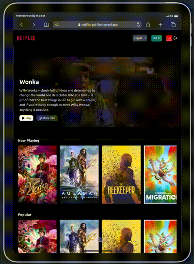
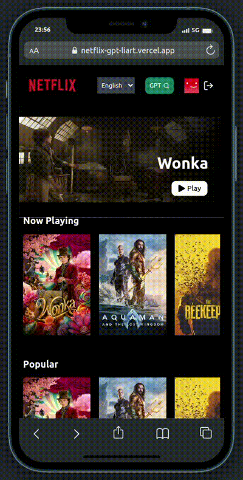
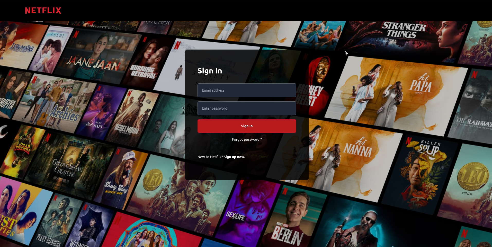
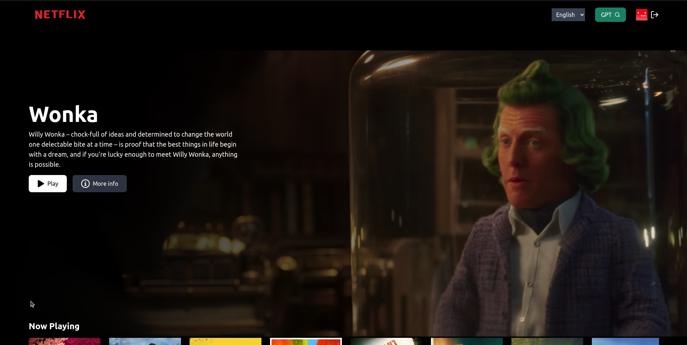
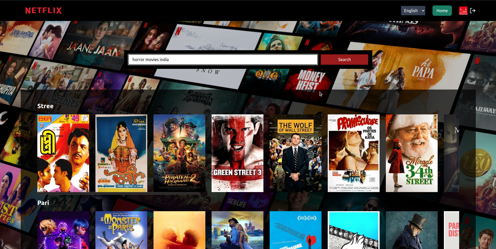

# NetflixGPT

FlixGPT is a web application built using React.js, Redux Toolkit, and Tailwind CSS. It utilizes GPT's API to provide movie recommendations based on user queries. The app features a search bar powered by GPT, allowing users to search for anything and receive movie recommendations tailored to their query.

## Deployment

The application has been deployed on Vercel. You can access it [here](https://flix-gpt.vercel.app/).

## Features

- **GPT-Powered Search:** Utilizes GPT's API to provide movie recommendations based on user queries.
- **Memoization:** Implements memoization to avoid unnecessary API calls, improving performance.
- **Responsive Design:** Built with responsiveness in mind, ensuring optimal user experience across all devices.
- **Pages:**
  - **Login Page:** Allows users to log in to their accounts.
  - **Browse Page:** Displays categorized movie cards, including popular, upcoming, top-rated, and currently playing movies.
  - **GPT Search Page:** Features the GPT-powered search bar for users to discover movie recommendations.

## Technologies Used

- **Frontend:**
  - React.js
  - Redux Toolkit
  - Tailwind CSS
  - React Router DOM
- **Backend:**
  - Firebase for user authentication
  - TMDB API for fetching movie details

## Additional Features

- **Form Validation:** Implements form validation to enhance user experience and ensure data integrity.
- **User Authentication:** Utilizes Firebase for user authentication, ensuring secure access to the application.
- **Dynamic UI Elements:** Incorporates dynamic elements such as video backgrounds and categorized movie cards for an engaging user experience.
- **Language Support:** Offers support for English, Hindi, and Marathi languages with integrated language-switching feature.

## Screenshots and Videos

### Screen Casting Video




### Login Page



### Browse Page


### GPT Search Page


## Installation

1. Clone the repository:

   ```bash
   git clone https://github.com/parshurambagade/netflix-gpt.git

2. Install dependencies::
    ```bash
    cd NetflixGPT
    npm install

3. Run the development server:
    ```bash
    npm start

4. Access the application in your browser at http://localhost:3000.